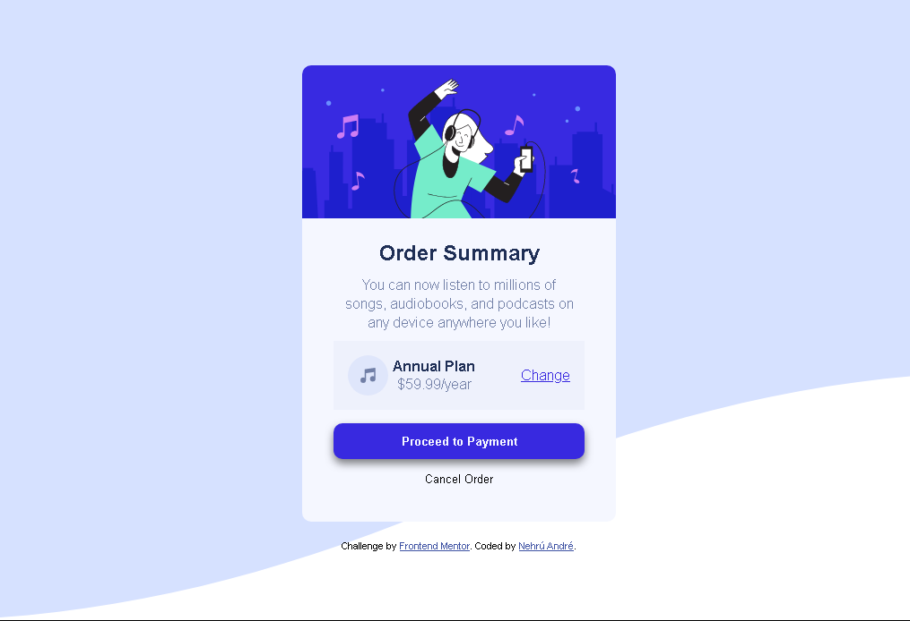

# Frontend Mentor - Order summary card solution

This is a solution to the [Order summary card challenge on Frontend Mentor](https://www.frontendmentor.io/challenges/order-summary-component-QlPmajDUj). Frontend Mentor challenges help you improve your coding skills by building realistic projects. 

## Overview

### Screenshot

### Links

- Solution URL: [Github](https://github.com/nehru35/Order-Summary-Component-Main)
- Live Site URL: [Netlify](https://ordersummarycardpage.netlify.app/)

## My process

### Built with

- Semantic HTML5 markup
- CSS custom properties
- Flexbox
- Mobile-first workflow

## Author

- Website - [Nehrú André](https://nehruandre.netlify.app)
- Frontend Mentor - [@nehru35](https://www.frontendmentor.io/profile/nehru35)
- Twitter - [@nehru_andre](https://twitter.com/nehru_andre)
